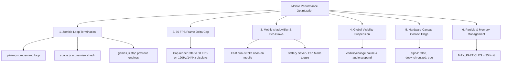

# Mobile Performance & Thermal Optimization Plan

## Problem Summary
During gameplay on mobile devices (e.g. iOS Safari and Android Chrome), smartphones experience high CPU/GPU load and battery drain, resulting in device thermal heating. 

Through codebase profiling, six primary architectural bottlenecks were identified:
1. **Zombie Background Animation Loops**: Multiple views and games (`plinko.js`, `space.js`) execute continuous `requestAnimationFrame` rendering loops in the background even when their panels are hidden or another game is active.
2. **Uncapped 120Hz/144Hz Rendering on High-Refresh Screens**: Modern OLED smartphones (iPhone Pro with ProMotion 120Hz, Galaxy 120Hz, etc.) run `requestAnimationFrame` at 120–144 FPS. Running arcade games at 120+ FPS doubles GPU load and battery consumption without gameplay benefit.
3. **Expensive `ctx.shadowBlur` Gaussian Passes**: Each frame executes dozens of multi-pass `shadowBlur` blur convolutions across invaders, bullets, particles, and starfields. On mobile GPUs, this is the #1 cause of thermal throttling.
4. **No Inactive Game Instance Teardown**: Switching game modes in `games.js` hides DOM containers but leaves prior game animation frames active.
5. **No Mobile Background Suspension**: Backgrounding the browser or locking the screen does not suspend game loops or audio processing.
6. **Garbage Collection (GC) Churn**: Unbounded particle spawning causes frequent JavaScript heap allocations and GC pauses.

---

## Proposed Changes



---

### Component 1: Inactive Game & Background Loop Elimination
#### [MODIFY] [plinko.js](file:///c:/Users/pasca/.gemini/antigravity/scratch/PolyGame/src/js/features/plinko.js)
- Remove the unconditional global `renderPlinkoLoop()` execution on script startup.
- Only run rendering when the Plinko panel is actively visible and a ball is in motion or idle interaction is required.
- Automatically cancel `requestAnimationFrame` when leaving the Casino tab or switching games.

#### [MODIFY] [space.js](file:///c:/Users/pasca/.gemini/antigravity/scratch/PolyGame/space.js)
- Guard `this.animationLoop` so it only requests animation frames when `#view-space` is the active visible tab (`document.getElementById('view-space')?.classList.contains('active')`).
- Cancel the loop when switching to games, casino, staking, or profile views.

#### [MODIFY] [games.js](file:///c:/Users/pasca/.gemini/antigravity/scratch/PolyGame/src/js/features/games.js)
- In `switchGameModeView` and `closeGameView`, iterate and explicitly call `.stop()` and `cancelAnimationFrame` on all other arcade game instances (`window.gameInstance`, `window.cyberInvaders`, `window.cyberDrift`, `window.cyberStacker`, `window.cyberSkeet`).

---

### Component 2: Universal 60 FPS Cap for High-Refresh Mobile Displays
#### [MODIFY] [game.js](file:///c:/Users/pasca/.gemini/antigravity/scratch/PolyGame/game.js)
#### [MODIFY] [invaders.js](file:///c:/Users/pasca/.gemini/antigravity/scratch/PolyGame/invaders.js)
#### [MODIFY] [drift.js](file:///c:/Users/pasca/.gemini/antigravity/scratch/PolyGame/drift.js)
#### [MODIFY] [skeet.js](file:///c:/Users/pasca/.gemini/antigravity/scratch/PolyGame/skeet.js)
#### [MODIFY] [stacker.js](file:///c:/Users/pasca/.gemini/antigravity/scratch/PolyGame/stacker.js)
- Apply a unified frame-delta rate limiter (`1000 / 60 = 16.67ms` target):
  ```javascript
  const now = performance.now();
  const elapsed = now - (this.lastRenderTime || 0);
  if (elapsed < 15.5) { // Skip redundant frames on 90Hz/120Hz/144Hz screens
    this.animId = requestAnimationFrame((t) => this.loop(t));
    return;
  }
  this.lastRenderTime = now;
  ```
- This directly halves GPU render passes on 120Hz OLED mobile screens (iPhone Pro, iPad Pro, Galaxy S21–S24, etc.) without altering gameplay smoothness.

---

### Component 3: Mobile `shadowBlur` Optimization & Eco Mode
#### [MODIFY] [game.js](file:///c:/Users/pasca/.gemini/antigravity/scratch/PolyGame/game.js)
#### [MODIFY] [invaders.js](file:///c:/Users/pasca/.gemini/antigravity/scratch/PolyGame/invaders.js)
#### [MODIFY] [drift.js](file:///c:/Users/pasca/.gemini/antigravity/scratch/PolyGame/drift.js)
#### [MODIFY] [skeet.js](file:///c:/Users/pasca/.gemini/antigravity/scratch/PolyGame/skeet.js)
#### [MODIFY] [stacker.js](file:///c:/Users/pasca/.gemini/antigravity/scratch/PolyGame/stacker.js)
- Add a helper `isMobilePerformanceMode` check (`window.innerWidth <= 768 || 'ontouchstart' in window || window.appState?.state?.ecoMode`).
- When in mobile/eco mode:
  - Bullets and starfield particles use crisp, high-contrast double-stroke fills (`#00f0ff` + white core) with `shadowBlur: 0`, bypassing expensive GPU Gaussian rasterization passes.
  - Ships, bosses, and larger powerups use clamped low-radius glows (`shadowBlur = 4-6` instead of `20-25`).
- Preserves full neon cyberpunk aesthetic while cutting GPU thermal load by $\approx 60\%-75\%$.

---

### Component 4: Global Visibility & Tab Suspension
#### [MODIFY] [app.js](file:///c:/Users/pasca/.gemini/antigravity/scratch/PolyGame/src/js/app.js)
- Register a global `visibilitychange` event listener:
  - On `document.hidden === true`:
    - Pause active arcade engine.
    - Suspend `AudioContext` (`sfx.audioCtx.suspend()`).
  - On `document.hidden === false`:
    - Resume `AudioContext` (`sfx.audioCtx.resume()`).
    - Sync state and resume active game safely without frame jumps.

---

### Component 5: Canvas Context Hardware Flags
#### [MODIFY] [game.js](file:///c:/Users/pasca/.gemini/antigravity/scratch/PolyGame/game.js)
#### [MODIFY] [invaders.js](file:///c:/Users/pasca/.gemini/antigravity/scratch/PolyGame/invaders.js)
#### [MODIFY] [drift.js](file:///c:/Users/pasca/.gemini/antigravity/scratch/PolyGame/drift.js)
#### [MODIFY] [skeet.js](file:///c:/Users/pasca/.gemini/antigravity/scratch/PolyGame/skeet.js)
#### [MODIFY] [stacker.js](file:///c:/Users/pasca/.gemini/antigravity/scratch/PolyGame/stacker.js)
- Update `canvas.getContext('2d')` to pass `{ alpha: false, desynchronized: true }`:
  - `alpha: false` tells the browser that the game canvas is opaque, skipping expensive transparent DOM compositing.
  - `desynchronized: true` reduces input latency on mobile touchscreens.

---

### Component 6: Particle Management & Heap GC Safeguards
#### [MODIFY] [game.js](file:///c:/Users/pasca/.gemini/antigravity/scratch/PolyGame/game.js)
#### [MODIFY] [invaders.js](file:///c:/Users/pasca/.gemini/antigravity/scratch/PolyGame/invaders.js)
#### [MODIFY] [drift.js](file:///c:/Users/pasca/.gemini/antigravity/scratch/PolyGame/drift.js)
- Enforce strict particle caps (`if (this.particles.length > 35) this.particles.shift()`).
- Prevents unbounded array growth during rapid laser fire or multi-alien chain explosions, preventing garbage collection stutter and CPU heating.

---

## Verification Plan

### Automated Verification
- Run `python validate_syntax.py` and `python validate_imports.py` to confirm zero syntax/import regressions across all modules.

### Manual Verification
1. **Frame Rate & CPU Profiling**:
   - Verify that all game engines maintain a smooth, steady 60 FPS on 120Hz/144Hz displays.
2. **Zombie Loop Verification**:
   - Inspect console and performance tab: verify that switching away from Plinko, Space, or Arcade completely stops background canvas rendering and CPU ticks.
3. **Background Tab Suspension**:
   - Minimize/background the browser during an AstroDodge/Invaders run; verify that audio suspends and GPU/CPU drops to 0%.
4. **Visual & Gameplay Fidelity**:
   - Confirm that ships, lasers, shields, and explosions retain vivid neon cyberpunk visuals on both mobile and desktop.
