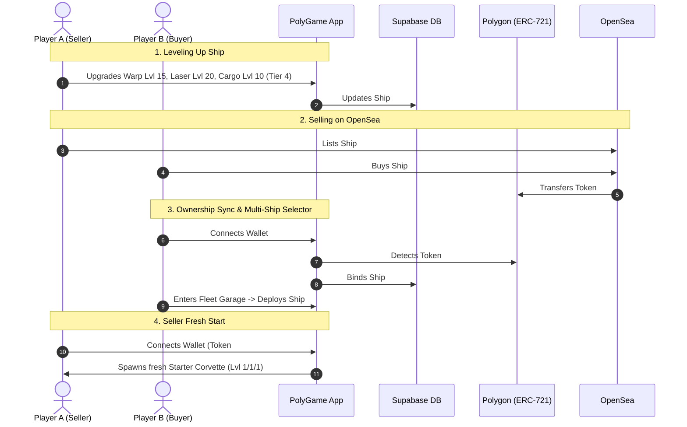

# PolySpace Dynamic Starship NFT: Token-Bound Progression & Multi-Ship Garage

This document details the complete design for the **PolySpace Dynamic Starship NFT System**, where module levels (`warpLevel`, `laserLevel`, `cargoLevel`, `shipTier`) are **permanently bound to the specific Starship NFT token**. 

Selling a Starship NFT on OpenSea transfers the entire ship's level and progression to the buyer, while the seller can start fresh or switch to another Starship NFT in their Garage.

---

## 🌟 Core Web3 Dynamic NFT Architecture



---

## 🚀 Key System Features

### 1. Token-Bound Levels & Stats
Each Starship NFT has its own distinct identity and progression:
* **Token ID**: Unique on-chain token ID (or in-game starter ship ID).
* **Module Levels**:
  * `warp_level` (1–50)
  * `laser_level` (1–50)
  * `cargo_level` (1–50)
* **Ship Tier & Class** (Evolves every 5 levels):
  * **Tier 1 (Lvl 1–4)**: *Scout Corvette*
  * **Tier 2 (Lvl 5–9)**: *Plasma Frigate*
  * **Tier 3 (Lvl 10–14)**: *Void Cruiser*
  * **Tier 4 (Lvl 15–19)**: *Titan Battlecruiser*
  * **Tier 5 (Lvl 20–24)**: *Apex Dreadnought*
  * **Tier 6 (Lvl 25–29)**: *Singularity Flagship*
  * **Tier 7 (Lvl 30–50)**: *Genesis Mothership*

### 2. Multi-Ship Fleet Garage / Selector
If a player owns multiple Starship NFTs (e.g. their starter ship + a ship bought on OpenSea):
* The **PolySpace Hangar** features a **"🛸 Fleet Garage"** switcher.
* Players can browse all their ships, compare stats/tiers, and click **"⚡ Deploy as Active Flagship"**.
* Upgrading modules upgrades the **currently active deployed ship**.

### 3. OpenSea Trading & Progression Portability
* When a ship is transferred or sold on Polygon:
  * **Buyer**: Inherits the exact levels, tier, and Fleet Power upon connecting their wallet.
  * **Seller**: Loses access to the sold ship. If the seller has no other ships, the game automatically grants a fresh Level 1 Starter Ship so they can start building again!
* **OpenSea Metadata**: Dynamically reflects the ship's live levels and traits (`Warp Level`, `Laser Level`, `Cargo Capacity`, `Fleet Power`, `Ship Tier`).

---

## 🗄️ Database & Technical Plan

### 1. Supabase `starships` Table
```sql
CREATE TABLE IF NOT EXISTS starships (
  id UUID PRIMARY KEY DEFAULT gen_random_uuid(),
  token_id BIGINT UNIQUE,
  owner_player_id TEXT NOT NULL,
  owner_wallet_address TEXT,
  name TEXT DEFAULT 'PolySpace Flagship',
  warp_level INTEGER DEFAULT 1,
  laser_level INTEGER DEFAULT 1,
  cargo_level INTEGER DEFAULT 1,
  ship_tier INTEGER DEFAULT 1,
  is_active BOOLEAN DEFAULT false,
  created_at TIMESTAMPTZ DEFAULT NOW(),
  updated_at TIMESTAMPTZ DEFAULT NOW()
);
```

### 2. Frontend Integration
* **`space.js`**:
  * Refactor module upgrades to modify the active ship's record.
  * Add **Fleet Garage Modal / Selector** in the Hangar with visual tier cards.
  * Update `renderHangarView()` to render the active ship's evolving 2D canvas/SVG model based on its tier (Tier 1 $\rightarrow$ Tier 7).
* **`db-sync.js`**:
  * On login / wallet connect, scan Polygon for owned Starship token IDs.
  * Sync ownership in `starships` table and load the player's active ship.

---

## 📜 Smart Contract Architecture: `PolyGameStarshipNFT.sol`

Here is the complete production-grade ERC-721 smart contract designed specifically for the Dynamic Starship NFT system:

```solidity
// SPDX-License-Identifier: MIT
pragma solidity ^0.8.20;

import "@openzeppelin/contracts/token/ERC721/ERC721.sol";
import "@openzeppelin/contracts/token/ERC721/extensions/ERC721Enumerable.sol";
import "@openzeppelin/contracts/token/ERC721/extensions/ERC721Burnable.sol";
import "@openzeppelin/contracts/token/common/ERC2981.sol";
import "@openzeppelin/contracts/access/Ownable.sol";
import "@openzeppelin/contracts/utils/Strings.sol";

/**
 * @title PolyGameStarshipNFT
 * @dev Dynamic, Upgradeable ERC-721 Starship Fleet Flagship on Polygon.
 * Supports ERC721Enumerable, ERC-2981 Royalties, and on-chain dynamic module stats.
 */
contract PolyGameStarshipNFT is ERC721, ERC721Enumerable, ERC721Burnable, ERC2981, Ownable {
    using Strings for uint256;

    uint256 private _nextTokenId;
    string public baseTokenURI = "https://polygongaming.io/metadata/ships/";
    uint256 public mintFee = 5 ether; // 5.0 POL Public Mint Fee

    struct StarshipStats {
        uint256 warpLevel;
        uint256 laserLevel;
        uint256 cargoLevel;
        uint256 shipTier;
        uint256 mintedAt;
        string name;
    }

    // Mapping from tokenId => Starship Stats
    mapping(uint256 => StarshipStats) public starshipStats;

    // Authorized sync operators (Backend relayer / Admin)
    mapping(address => bool) public authorizedOperators;

    // Events
    event StarshipMinted(address indexed owner, uint256 indexed tokenId, uint256 tier, string name);
    event StarshipUpgraded(uint256 indexed tokenId, uint256 warpLvl, uint256 laserLvl, uint256 cargoLvl, uint256 tier);
    event MintFeeUpdated(uint256 newFee);
    event BaseURIUpdated(string newBaseURI);

    modifier onlyAuthorized() {
        require(msg.sender == owner() || authorizedOperators[msg.sender], "Not authorized operator");
        _;
    }

    constructor(
        string memory name,
        string memory symbol,
        address royaltyReceiver
    ) ERC721(name, symbol) Ownable(msg.sender) {
        _nextTokenId = 1;

        // Default 5% Royalty (500 basis points)
        _setDefaultRoyalty(royaltyReceiver, 500);
        authorizedOperators[msg.sender] = true;
    }

    // --- PUBLIC MINTING ---

    /**
     * @dev Public mint a fresh Tier 1 Starter Starship (Level 1/1/1).
     */
    function mintStarship(string memory customName) external payable returns (uint256) {
        require(msg.value >= mintFee, "Insufficient POL fee sent");

        uint256 tokenId = _nextTokenId++;
        _safeMint(msg.sender, tokenId);

        starshipStats[tokenId] = StarshipStats({
            warpLevel: 1,
            laserLevel: 1,
            cargoLevel: 1,
            shipTier: 1,
            mintedAt: block.timestamp,
            name: bytes(customName).length > 0 ? customName : "PolySpace Flagship"
        });

        emit StarshipMinted(msg.sender, tokenId, 1, starshipStats[tokenId].name);
        return tokenId;
    }

    /**
     * @dev Bridge an existing in-game leveled-up ship to Polygon on-chain.
     */
    function bridgeInGameStarship(
        address recipient,
        uint256 warpLvl,
        uint256 laserLvl,
        uint256 cargoLvl,
        string memory shipName
    ) external payable onlyAuthorized returns (uint256) {
        uint256 tokenId = _nextTokenId++;
        _safeMint(recipient, tokenId);

        uint256 avgLvl = (warpLvl + laserLvl + cargoLvl) / 3;
        uint256 derivedTier = calculateTier(avgLvl);

        starshipStats[tokenId] = StarshipStats({
            warpLevel: warpLvl,
            laserLevel: laserLvl,
            cargoLevel: cargoLvl,
            shipTier: derivedTier,
            mintedAt: block.timestamp,
            name: bytes(shipName).length > 0 ? shipName : "PolySpace Flagship"
        });

        emit StarshipMinted(recipient, tokenId, derivedTier, starshipStats[tokenId].name);
        return tokenId;
    }

    // --- STATS UPGRADE & PROGRESSION SYNC ---

    /**
     * @dev Synchronizes upgraded module levels to the on-chain NFT.
     */
    function updateStarshipStats(
        uint256 tokenId,
        uint256 warpLvl,
        uint256 laserLvl,
        uint256 cargoLvl
    ) external onlyAuthorized {
        require(_ownerOf(tokenId) != address(0), "Token does not exist");

        uint256 avgLvl = (warpLvl + laserLvl + cargoLvl) / 3;
        uint256 derivedTier = calculateTier(avgLvl);

        StarshipStats storage stats = starshipStats[tokenId];
        stats.warpLevel = warpLvl;
        stats.laserLevel = laserLvl;
        stats.cargoLevel = cargoLvl;
        stats.shipTier = derivedTier;

        emit StarshipUpgraded(tokenId, warpLvl, laserLvl, cargoLvl, derivedTier);
    }

    function calculateTier(uint256 level) public pure returns (uint256) {
        if (level >= 30) return 7; // Genesis Mothership
        if (level >= 25) return 6; // Singularity Flagship
        if (level >= 20) return 5; // Apex Dreadnought
        if (level >= 15) return 4; // Titan Battlecruiser
        if (level >= 10) return 3; // Void Cruiser
        if (level >= 5)  return 2; // Plasma Frigate
        return 1;                  // Scout Corvette
    }

    // --- FAST ENUMERATION & VIEW HELPERS ---

    /**
     * @dev 1-Call helper for PolyGame frontend: returns all token IDs owned by address.
     */
    function tokensOfOwner(address owner) external view returns (uint256[] memory) {
        uint256 tokenCount = balanceOf(owner);
        uint256[] memory result = new uint256[](tokenCount);
        for (uint256 i = 0; i < tokenCount; i++) {
            result[i] = tokenOfOwnerByIndex(owner, i);
        }
        return result;
    }

    /**
     * @dev Returns full stats for an array of tokens in a single call.
     */
    function getBatchStarshipStats(uint256[] calldata tokenIds) external view returns (StarshipStats[] memory) {
        StarshipStats[] memory result = new StarshipStats[](tokenIds.length);
        for (uint256 i = 0; i < tokenIds.length; i++) {
            result[i] = starshipStats[tokenIds[i]];
        }
        return result;
    }

    // --- METADATA & OPENSEA ---

    function tokenURI(uint256 tokenId) public view override returns (string memory) {
        require(_ownerOf(tokenId) != address(0), "Token does not exist");
        return string(abi.encodePacked(baseTokenURI, tokenId.toString(), ".json"));
    }

    // --- ADMIN CONFIGURATION ---

    function setAuthorizedOperator(address operator, bool authorized) external onlyOwner {
        authorizedOperators[operator] = authorized;
    }

    function setMintFee(uint256 newFee) external onlyOwner {
        mintFee = newFee;
        emit MintFeeUpdated(newFee);
    }

    function setBaseURI(string memory newBaseURI) external onlyOwner {
        baseTokenURI = newBaseURI;
        emit BaseURIUpdated(newBaseURI);
    }

    function setDefaultRoyalty(address receiver, uint96 feeNumerator) external onlyOwner {
        _setDefaultRoyalty(receiver, feeNumerator);
    }

    function withdrawTreasury() external onlyOwner {
        uint256 bal = address(this).balance;
        require(bal > 0, "No balance to withdraw");
        (bool success, ) = payable(owner()).call{value: bal}("");
        require(success, "Withdrawal failed");
    }

    // --- REQUIRED OVERRIDES ---

    function _update(address to, uint256 tokenId, address auth) internal override(ERC721, ERC721Enumerable) returns (address) {
        return super._update(to, tokenId, auth);
    }

    function _increaseBalance(address account, uint128 value) internal override(ERC721, ERC721Enumerable) {
        super._increaseBalance(account, value);
    }

    function supportsInterface(bytes4 interfaceId) public view override(ERC721, ERC721Enumerable, ERC2981) returns (bool) {
        return super.supportsInterface(interfaceId);
    }
}
```

---

## 🛠️ Execution Phases

1. **Phase 1**: Save `contracts/PolyGameStarshipNFT.sol` smart contract in the repository.
2. **Phase 2**: Create `starships` database schema & migration in Supabase for multi-ship progression.
3. **Phase 3**: Implement the 7 visual ship tier artwork generators (SVG/Canvas) in `space.js`.
4. **Phase 4**: Implement the **Fleet Garage & Ship Selector UI** in PolySpace Hangar.
5. **Phase 5**: Wire module upgrades directly to the active ship and trigger tier evolution fanfares every 5 levels.
6. **Phase 6**: Connect on-chain scanner (`tokensOfOwner`) & dynamic OpenSea metadata pipeline.


