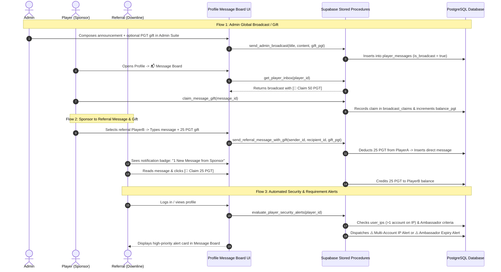

# PLAN-006: Profile Message Board, Social Gifting & Security Alert System

**Plan ID**: `PLAN-006`  
**Status**: Saved for Future Implementation  
**Created**: 2026-09-08  

---

## Executive Summary

This specification defines the architecture for an in-app **Message Board, Notification Center & Social Gifting Hub** embedded directly into **"My Profile"** (`#view-profile`).

It addresses three core platform communication needs:
1. **Admin to All (Broadcasts & Community Gifts)**: Master Admin can send platform-wide announcements or attach claimable PGT gifts to all active players.
2. **Player to Referral (Downline Communication & Token Gifting)**: Players can send messages and attach direct PGT gifts to their referred downlines (or upline sponsor) to incentivize activity.
3. **Automated System Alerts (Security & Requirements Monitoring)**: Automated in-app security notifications (e.g. multiple accounts detected on the same IP) and status alerts (e.g. Ambassador VIP/referral requirement expiry, tournament prize payouts, withdrawal updates).

---

## Confirmed Business & Technical Rules

1. **Gift Balance Safeguards**:
   - **Player-to-Referral Gifts**: When a player sends a PGT gift to a referral, the PGT is atomically deducted from the sender's balance upon sending and held in escrow until the recipient clicks **[ 🎁 Claim Gift ]**.
   - **Admin Global Gifts**: When an Admin sends a global gift (e.g. 50 PGT to all active players), each player can claim it **exactly once** via an atomic `broadcast_claims` ledger.
   - **Minimum Gift**: 5 PGT minimum to prevent micro-spam.
2. **Spam Prevention on Referral Messages**:
   - Players can only message their direct referrals (Level 1 downlines) or their direct upline sponsor.
   - Cooldown: 1 message per 2 minutes per recipient.
3. **Automated Security Sentinel**:
   - Multi-Account IP Check: If 2+ distinct player accounts log in from the same IP address in a 7-day rolling window, a high-priority security warning is dispatched to their in-app inbox.
   - Ambassador Status Monitor: If an Ambassador's active VIP expires or their active referral count drops below 5, an in-app requirement warning is automatically dispatched.

---

## Architecture Overview



---

## Database Architecture (`supabase/add_profile_message_board_system.sql`)

### 1. Table: `public.player_messages`
```sql
CREATE TABLE IF NOT EXISTS public.player_messages (
  id UUID PRIMARY KEY DEFAULT gen_random_uuid(),
  sender_id TEXT NOT NULL,                  -- 'SYSTEM', 'ADMIN', or player_id
  sender_name TEXT NOT NULL,                -- Display name or title
  sender_role TEXT DEFAULT 'player',        -- 'admin', 'system', 'sponsor', 'ambassador', 'player'
  recipient_id TEXT NOT NULL,               -- 'ALL' for broadcasts, or target player_id
  category TEXT NOT NULL,                   -- 'announcement', 'gift', 'security_alert', 'referral', 'status_alert'
  priority TEXT NOT NULL DEFAULT 'normal',  -- 'normal', 'high', 'urgent'
  title TEXT NOT NULL,
  content TEXT NOT NULL,
  gift_type TEXT DEFAULT NULL,              -- 'pgt', 'crate', etc.
  gift_amount NUMERIC DEFAULT 0.0,
  gift_claimed BOOLEAN DEFAULT false,       -- For 1-on-1 direct messages
  is_broadcast BOOLEAN DEFAULT false,
  expires_at TIMESTAMPTZ DEFAULT NULL,
  created_at TIMESTAMPTZ DEFAULT NOW()
);

CREATE INDEX IF NOT EXISTS idx_player_messages_recipient ON public.player_messages(recipient_id, created_at DESC);
CREATE INDEX IF NOT EXISTS idx_player_messages_broadcast ON public.player_messages(is_broadcast, created_at DESC);
```

### 2. Table: `public.broadcast_claims`
```sql
CREATE TABLE IF NOT EXISTS public.broadcast_claims (
  message_id UUID REFERENCES public.player_messages(id) ON DELETE CASCADE,
  player_id TEXT NOT NULL,
  claimed_at TIMESTAMPTZ DEFAULT NOW(),
  PRIMARY KEY (message_id, player_id)
);
```

### 3. Table: `public.message_reads`
```sql
CREATE TABLE IF NOT EXISTS public.message_reads (
  message_id UUID REFERENCES public.player_messages(id) ON DELETE CASCADE,
  player_id TEXT NOT NULL,
  read_at TIMESTAMPTZ DEFAULT NOW(),
  PRIMARY KEY (message_id, player_id)
);
```

---

## Stored Procedures (RPCs)

1. `get_player_inbox(p_player_id TEXT)`:
   - Fetches all direct messages where `recipient_id = p_player_id` + all active broadcasts (`recipient_id = 'ALL'`).
   - Annotates each record with `is_read` (joined from `message_reads`) and `is_gift_claimed` (joined from `broadcast_claims` or `gift_claimed`).
   - Returns unread count badge + ordered message list.

2. `claim_message_gift(p_player_id TEXT, p_message_id UUID)`:
   - Atomic `SECURITY DEFINER` balance credit.
   - For direct gift: verifies `recipient_id = p_player_id`, `gift_claimed = false`, sets `gift_claimed = true`, and credits `balance_pgt`.
   - For broadcast gift: inserts into `broadcast_claims`, credits `balance_pgt`.

3. `send_referral_message_with_gift(p_sender_id TEXT, p_recipient_id TEXT, p_title TEXT, p_content TEXT, p_gift_amount NUMERIC)`:
   - Verifies referral relationship (sender referred recipient or vice versa).
   - If `gift_amount > 0`: verifies balance, deducts from sender immediately.
   - Inserts message with `category = 'referral'`.

4. `send_admin_broadcast(p_admin_wallet TEXT, p_title TEXT, p_content TEXT, p_category TEXT, p_priority TEXT, p_gift_amount NUMERIC)`:
   - Validates Master Admin authority.
   - Inserts broadcast message with `recipient_id = 'ALL'`, `is_broadcast = true`.

5. `evaluate_player_security_alerts(p_player_id TEXT)`:
   - Automatically checks:
     - **Multi-Account IP**: If multiple accounts share this IP in `user_ips`, sends `security_alert`.
     - **Ambassador Status**: If `is_ambassador = true` but VIP is expired or active referrals < 5, sends `status_alert`.
   - Rate-limited to max once every 7 days per alert type.

---

## Frontend Integration

1. **Sub-Tab Navigation in `#view-profile`**:
   - `👤 Account Overview & Career`
   - `🏺 Quantum Relics Vault (0/17)`
   - `📬 Message Board & Inbox (<span id="profile-unread-badge">0</span>)`
2. **Inbox View Elements**:
   - Filter pills: `All`, `Gifts 🎁`, `Announcements 📢`, `Alerts ⚠️`, `Referrals 👥`.
   - Action buttons: `[ ✍️ Send to Referral ]` and `[ 🧹 Mark All Read ]`.
   - Interactive gift cards with `[ 🎁 Claim PGT ]` button.
3. **Master Admin Broadcast Suite in `#view-admin`**:
   - Dedicated card to draft broadcasts, select category, attach global gifts, and select target audiences.
