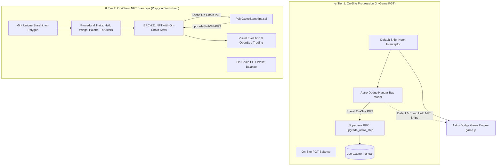

# Astro-Dodge Hangar System: Dual-Tier & Generative NFT Architecture

Implement an interactive **Starship Hangar & Tuning Bay** for Astro-Dodge featuring a clean separation between **On-Site Gameplay Progression** and **On-Chain Generative NFT Starships**:
1. **Tier 1 (On-Site Default Ship)**: Available to all pilots, upgraded in-game using **on-site PGT balance** across 4 combat skills (totaling ~2,000,000 PGT endgame sink), with 3 visual frames including the Relic-Trio unlocked **Apex Sovereign**.
2. **Tier 2 (On-Chain Generative NFT Starships)**: Mintable ERC-721 Starships on Polygon where **every minted ship is visually unique** (36,000+ procedural trait combinations). Skills are upgraded directly on-chain using **on-chain PGT**, and ships **evolve visually** as they level up, creating tradeable, battle-hardened assets for OpenSea.

---

## Architecture Overview



---

## 1. Tier 1: On-Site Default Starship & PGT Economy

### A. The 4 Combat Skill Trees (Max Level 5 Each)
Each skill tree has 5 progression tiers. Costs scale exponentially to create an endgame **2,000,000 PGT** total sink (500,000 PGT per tree).

| Skill Node | In-Game Effect | Level 0 (Stock) | Level 1 | Level 2 | Level 3 | Level 4 | Level 5 (Max) | On-Site PGT Cost |
| :--- | :--- | :--- | :--- | :--- | :--- | :--- | :--- | :--- |
| **⚡ Rapid Fire Capacitors** | Reduces shot cooldown & increases auto-fire cadence | 140ms cooldown<br>(9 frames) | 130ms<br>(8.5 frames) | 120ms<br>(8 frames) | 110ms<br>(7.5 frames) | 100ms<br>(7 frames) | 90ms<br>(6 frames) | **L1**: 10k<br>**L2**: 35k<br>**L3**: 85k<br>**L4**: 170k<br>**L5**: 300k |
| **💥 Plasma Beam Amplifier** | Boosts laser & missile impact damage | Bullet: 1.0 dmg<br>Missile: 3.0 dmg | Bullet: 1.3 dmg<br>Missile: 3.6 dmg | Bullet: 1.6 dmg<br>Missile: 4.2 dmg | Bullet: 1.9 dmg<br>Missile: 4.8 dmg | Bullet: 2.2 dmg<br>Missile: 5.4 dmg | Bullet: 2.6 dmg<br>Missile: 6.0 dmg | **L1**: 10k<br>**L2**: 35k<br>**L3**: 85k<br>**L4**: 170k<br>**L5**: 300k |
| **🛡️ Overdrive Cell Matrix** | Extends duration of Energy Shield, Quad-Laser & Chronos Slow-mo | Shield: 20s<br>Quad: 20s<br>Slow: 10s | Shield: 23s<br>Quad: 23s<br>Slow: 11.5s | Shield: 26s<br>Quad: 26s<br>Slow: 13s | Shield: 29s<br>Quad: 29s<br>Slow: 14.5s | Shield: 32s<br>Quad: 32s<br>Slow: 16s | Shield: 35s<br>Quad: 35s<br>Slow: 18s | **L1**: 10k<br>**L2**: 35k<br>**L3**: 85k<br>**L4**: 170k<br>**L5**: 300k |
| **🚀 Micro-Missile Reloader** | Accelerates seeking missile launch cadence during Lvl 2 weapon overcharge | 1 missile per 2.0s<br>(120 frames) | 1 missile per 1.8s<br>(108 frames) | 1 missile per 1.6s<br>(96 frames) | 1 missile per 1.4s<br>(84 frames) | 1 missile per 1.2s<br>(72 frames) | 1 missile per 1.0s<br>(60 frames) | **L1**: 10k<br>**L2**: 35k<br>**L3**: 85k<br>**L4**: 170k<br>**L5**: 300k |

*Total On-Site PGT investment for full max*: **2,000,000 PGT** (500k × 4).

### B. On-Site Starship Chassis / Frames (3 Frames)
1. **🔷 Neon Stealth Interceptor (Default)**: Free for all pilots.
2. **💜 Phantom Voidstalker**: 100,000 on-site PGT license.
3. **👑 Apex Sovereign (Master Relic Edition)**: Unlocked exclusively by possessing the **3 AstroDodge Quantum Relics** in inventory:
   - 💎 **Quantum Prism** (`relic_astrododge_prism`)
   - 🛡️ **Kinetic Deflector** (`relic_astrododge_deflector`)
   - 🧭 **Chrono Compass** (`relic_astrododge_compass`)

---

## 2. Tier 2: Generative Unique NFT Starships & On-Chain PGT

### A. Combinatorial Trait System (36,000+ Unique Ships)
Every minted NFT starship is procedurally assembled across 6 distinct visual trait layers:
1. **Chassis Archetype** (5 styles): *Delta Interceptor*, *Heavy Dreadnought*, *Stealth Dart*, *Valkyrie Fighter*, *Void Cruiser*.
2. **Wing Geometry** (6 shapes): *Swept-Back*, *Forward-Swept*, *Twin-Boom*, *Ring-Wings*, *Blade-Canards*, *Double-Delta*.
3. **Hull Color Palette** (8 colorways): *Neon Cyan*, *Hot Magenta*, *Solar Amber*, *Emerald Matrix*, *Void Obsidian*, *Royal Purple*, *Arctic White*, *Hyper Chrome*.
4. **Cockpit Canopy** (5 styles): *Polarized Diamond*, *Hexagonal Mesh*, *Slit Sensor*, *Golden Hologram*, *Amber Bubble*.
5. **Thruster Plumes** (5 types): *Dual Ion Cyan*, *Twin Plasma Violet*, *Quad Solar Flare*, *Heavy Warp Rings*, *Singularity Blue*.
6. **Hull Decals & Trim** (6 patterns): *Dual Racing Stripes*, *Cyber Hex Grid*, *Hazard Chevron*, *Camo Edge*, *Veteran Stars*, *Clean Minimal*.

### B. Procedural 1:1 In-Game Canvas Rendering
Because `game.js` renders starships dynamically using HTML5 Canvas paths, gradients, and glow filters:
- The game engine directly consumes the NFT's trait seed.
- Your personal NFT starship renders with its exact wing geometry, color palette, canopy glint, and thruster plumes inside the live arcade session.

### C. Visual Skill Evolution
As players upgrade skills on-chain using on-chain PGT:
- **Rapid Fire Upgrade**: Adds twin high-intensity laser muzzle diodes onto the wingtips.
- **Micro-Missile Upgrade**: Twin physical missile pods visibly attach to the outer wing rails.
- **Plasma Beam Upgrade**: The central nose cannon gains super-heated glowing energy coils.
- **Overdrive Upgrade**: Afterburner thruster plumes expand in length and emit extra plasma sparks.

### D. Smart Contract Architecture (`PolyGameStarships.sol`)
- **ERC-721 + ERC-4906** (Metadata Update Standard) on Polygon.
- On-chain `ShipStats` struct bound directly to `tokenId`.
- `upgradeSkillWithPGT(tokenId, skillType)`: Transfers/burns on-chain PGT from player's wallet and emits `MetadataUpdate(tokenId)` for automatic OpenSea trait refreshing.
- Fully tradeable on secondary marketplaces with all combat levels and visual traits preserved for the buyer.

---

## Proposed Changes (Phase 1 Implementation)

### Database Layer (PostgreSQL / Supabase)

#### [NEW] [`supabase/add_astro_hangar_system.sql`](file:///c:/Users/pasca/.gemini/antigravity/scratch/PolyGame/supabase/add_astro_hangar_system.sql)
- Adds `astro_hangar` JSONB column to `public.users`.
- Implements `upgrade_astro_ship(p_wallet TEXT, p_skill_name TEXT)`:
  - Validates `fire_rate`, `beam_damage`, `boost_duration`, `missile_cadence`.
  - Enforces tier costs (10k, 35k, 85k, 170k, 300k PGT). Max Tier = 5.
  - Deducts `balance_pgt` with row lock `FOR UPDATE` and updates `users.astro_hangar`.
- Implements `unlock_astro_skin(p_wallet TEXT, p_skin_id TEXT)`:
  - Validates 100k PGT for `phantom`.
  - Verifies possession of the 3 AstroDodge Quantum Relics for `apex`.
- Hardens `prevent_direct_balance_mutation` trigger against client tampering.

---

### Frontend Core & UI

#### [MODIFY] [`src/js/core/config.js`](file:///c:/Users/pasca/.gemini/antigravity/scratch/PolyGame/src/js/core/config.js)
- Increment `APP_VERSION` to `"1.5.333"`.

#### [MODIFY] [`src/js/core/state.js`](file:///c:/Users/pasca/.gemini/antigravity/scratch/PolyGame/src/js/core/state.js)
- Initialize `astroHangar` state in `PolyState`.
- Add `checkApexSovereignEligible()` helper.

#### [MODIFY] [`index.html`](file:///c:/Users/pasca/.gemini/antigravity/scratch/PolyGame/index.html)
- Add **"🚀 Ship Hangar"** button on `#game-ui-overlay`.
- Deploy `#modal-astro-hangar`:
  - **Left Section**: Interactive rotating 3D canvas ship preview (60 FPS).
  - **Center/Right Section**:
    - 4 Skill upgrade cards with 5-segment level bars, stat previews, and PGT upgrade buttons.
    - 3 Frame selector cards (*Neon Interceptor*, *Phantom Voidstalker*, *Apex Sovereign* with relic status).
    - Teaser banner for upcoming Polygon On-Chain NFT Starships.

#### [NEW] [`src/js/features/hangar.js`](file:///c:/Users/pasca/.gemini/antigravity/scratch/PolyGame/src/js/features/hangar.js)
- Handles modal rendering, preview animation loop, and `upgrade_astro_ship` RPC execution.

#### [MODIFY] [`src/css/features/games.css`](file:///c:/Users/pasca/.gemini/antigravity/scratch/PolyGame/src/css/features/games.css)
- CSS for Hangar button, modal layout, skill progression bars, and skin cards.

---

### Astro-Dodge Game Engine

#### [MODIFY] [`game.js`](file:///c:/Users/pasca/.gemini/antigravity/scratch/PolyGame/game.js)
- Wire skills into live combat:
  - `fire_rate`: cooldown reduced from 140ms to 90ms.
  - `beam_damage`: bullet dmg (1.0 -> 2.6), missile dmg (3.0 -> 6.0).
  - `boost_duration`: shield/quad (20s -> 35s), slow-mo (10s -> 18s).
  - `missile_cadence`: seeking missile launch interval reduced from 2.0s down to 1.0s.
- Render ship with selected frame palette (*Neon Interceptor*, *Phantom Voidstalker*, *Apex Sovereign*).

---

### Smart Contract Asset (Phase 2 Companion)

#### [NEW] [`contracts/PolyGameStarships.sol`](file:///c:/Users/pasca/.gemini/antigravity/scratch/PolyGame/contracts/PolyGameStarships.sol)
- Deliver the Solidity contract with on-chain trait seeds, `ShipStats`, and `upgradeSkillWithPGT`.

---

## Verification Plan

### Automated Tests
- Syntax validate JavaScript files:
  ```bash
  node -c game.js
  node -c src/js/core/state.js
  node -c src/js/features/hangar.js
  ```

### Manual Verification
1. **Hangar Access**: Open Astro-Dodge -> click "🚀 Ship Hangar". Verify preview canvas animates at 60 FPS.
2. **Skill Progression**: Upgrade skills with on-site PGT. Verify balance deducts via database RPC and stats increase.
3. **Combat Mechanics**: Verify seeking missiles fire every 1.0s at Max Tier; verify rapid fire speed.
4. **Relic Trio Unlock**: Verify Apex Sovereign unlocks when holding Quantum Prism, Kinetic Deflector, and Chrono Compass.
